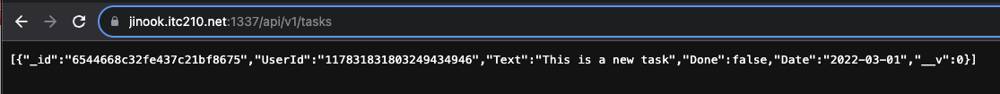

# Lab4 Writeup
Jinook Kim
11-04-2023

## Executive Summary
In our recent laboratory exercise, I successfully accomplished the development of a Node.js RESTful API utilizing Express and Express Middleware. This API was expressly crafted for the storage of user tasks, which we efficiently managed with CRUD functionality on MongoDB, a NoSQL database. Additionally, implementation and integration of Google API service were employed to enhance functionality and convenience. This lab has allowed me to hone my skills in backend development, specifically in creating reliable and efficient APIs, expanding my knowledge of modern databases, and learning the practical applications of Google services.

## Design Overview
My technical design for the project involves the creation of a Node.js RESTful API, which essentially acts as an intermediary layer that interfaces with a NoSQL Database, MongoDB, to store users' tasks. Using the principles of Representational State Transfer (REST), I was able to set up an API with Create, Read, Update, and Delete operations (commonly known as CRUD operations), enabling users to manage tasks efficiently. 

For the technological backbone of the API, I utilized Express and Express Middleware. Express is a minimal and flexible Node.js web application framework that provides a robust set of features for web and mobile applications. Essentially, it simplified the process of writing server code, negating the need to repeat the same code over and over. Additionally, the Express Middleware was implemented to handle requests more efficiently, providing a third-party extension point between request and response. It enabled the ability to add additional functionality like logging, parsing, etc to the server.

Moreover, the Google API service came in handy when incorporating external services. Specifically, it helped streamline the user authentication process ensuring secure logins. The project stored task data using MongoDB as it's a document database with the scalability and flexibility that you want with the querying and indexing that you need.

### UML Diagram


### Screenshots
#### Login Page


#### Tasks


#### Session Cookie


### Created/Modified files
#### app/index.js
The `index.js` file is the primary file in our API project. It holds all the necessary middleware and routes for the application to function properly. <br>
First, packages necessary for the functionality of the API are imported. These include express, cookie-parser, morgan, cors, session, passport, and mongoose. Also, the routes for user authentication (authRouter), user activities (userRouter), and task operations (tasksRouter) are imported. <br>
The application also utilizes express-session for storing session data. It's configured to use a secret key from the environmental variables, named 'it210_session', with cookies set to expire after a week. In the production environment, the application is set to trust the first proxy, serve secure cookies, and allow cookies to be sent to different URLs. <br>
For routing, the API uses a specific structure. Each router is assigned to its own route, enabling the separation of concerns in our code. For example, all requests to '/api/v1/user' will be handled by the userRouter, and requests to '/api/v1/auth' will be handled by the authRouter, and so forth. The authenticate middleware is used to secure appropriate routes, ensuring only authenticated users can access them. 

#### mongoose.js
The `mongoose.js` file has been designed to establish a connection to the MongoDB database. It does this by utilizing the "connect" method from the 'mongoose' package, and uses a connection string from the environment variables for this purpose. Once the connection is successful, it will log a confirmation in the console. If there's any error while attempting to connect, it will also be logged in the console.

#### passport.js
This file essentially deals with the establishment and management of user sessions using Passport, a middleware for Node.js, and Google OAuth for user authentication.<br>
The file sets up a connection to Google using environment variables for OAuth, and an asynchronous function is used to get or create a user in the MongoDB using a utility function.<br>
Additionally, a session storage is initialized in MongoDB for user sessions. It does this by creating a new MongoDbStore instance connected to MongoDB via the ATLAS_CONNECTION_STRING environment variable. Whenever a session is initialized or an error occurs, it's logged to the console. 

#### Task.js
The file `Task.js` is essentially responsible for defining the structure of the task entries that will be stored in our MongoDB database. 
<br>
The file starts by requiring the mongoose library, which is utilized for object data modeling (ODM). This enables the application to interact with the MongoDB database in an easy and structured way.
<br>
The next section defines a schema for the tasks using mongoose. This 'TaskSchema' specifies what kind of data each task will contain. Here, each task has four properties:
1. 'UserId' (type: String) is a required field and represents the user associated with the task.
2. 'Text' (type: String) is another required field and represents the description of the task.
3. 'Done' (type: Boolean) represents whether the task has been completed or not. It is not required and will default to 'false' if not provided.
4. 'Date' (type: String) is a required field and represents the date associated with the task.

<br>
After the schema definition, a mongoose model 'Task' is created based on the TaskSchema. 
<br>
Finally, the 'User' model is exported at the end of the file which enables its usage in different parts of the application for handling user data in the database.

#### User.js
This file is used for defining and managing the user data stored in the MongoDB database. 
<br>
Firstly, the file imports the mongoose library which is a tool used to model application data using MongoDB.
<br>
The file then outlines a schema named 'UserSchema' for user data. This schema specifies that each user has three required properties: 'Id', 'Email', and 'UserName', all of which are of the string data type.
<br>
Following the data schema, a mongoose model 'User' is created based on the defined UserSchema.
<br>
Finally, the 'User' model is exported at the end of the file which enables its usage in different parts of the application for handling user data in the database.

#### auth.js
The `auth.js` file enables user authentication functionality. When a user attempts to log in, they are directed to Google’s sign-in URL as defined in the '/google' GET route. After successfully authenticating with Google, users are redirected back to the application via the '/google/callback' URL.
<br>
The `/google/callback` route managing the saving of user sessions. If there is an error while saving a session, the application logs the user out and sends an HTTP status code of 500.
<br>
The `/logout` route handles user logout requests. It destroys the user's sessions and redirects back to the location specified by the environment variable 'CLIENT_ORIGIN'.

#### tasks.js
This file is responsible for defining the routes that perform create, read, update, and delete (CRUD) operations on task entries using the relevant HTTP methods.
<br>
Here's a summary of each function and its role:

1. `router.get('/:id')`: This function is triggered when a GET request is made for a specific task ID. It fetches and returns a task if it exists, identified by the ID specified in the request parameter. If the task does not exist, a 404 error message is returned. 
2. `router.post('/')`: This function is responsible for creating new tasks. It is triggered by a POST request, uses the data sent within the request body to create a new task and saves it. The created task is then returned.
3. `router.get('/')`: This function returns all tasks associated with a specific user. It gets triggered on a general GET request and returns all tasks tied to the user ID specified in the request.
4. `router.put('/:id')`: This function updates a specific task using the task ID and the new details provided in the request body. An updated task is returned after successful operation.
5. `router.delete('/:id')`: Lastly, this function deletes a specific task using the ID provided in the DELETE request. If the task is successfully deleted, a confirmation message is returned.

#### user.js
This file is another endpoint. Upon receiving a GET request at the endpoint '/', the router retrieves the currently authenticated user details from the request object, "req.user". If successful, the user information is sent back to the client with an HTTP status of 200 indicating a successful operation. Otherwise, if an error occurs during this operation, it gets logged, and a status of 500 (Internal Server Error) is sent back to the client, indicating that there was an issue retrieving the user data.

## Questions
### Name and discuss at least two of the benefits of writing unit tests before writing code.
#### It forces you (and the business side) to clearly define problems
"It's not uncommon to have a project that has an ever-growing scope with… poorly defined user stories. You'll have to stop and ask questions about how the business side wants to handle a certain scenario and they end up telling you to do something that has nothing to do with the original task.
<br>
"When you are writing tests first, you get all of those questions answered before you're deep into the code. It also gives you a way to somewhat control the scope of each task. You have to know exactly what a feature should be doing before you can write a test for it. This will give you a chance to ask all of the business questions upfront so that when you are writing code, you know exactly what you're writing and why. (<em>4 Reasons You Should Write Tests First</em>)"

#### It will allow you to write less code
"You only have to write enough code to pass the test. Once it passes, you're finished with that part. When you're trying to implement a large feature, it's easy to get lost in the code. Testing keeps you on track and focused when you are writing the code for that large feature. (<em>4 Reasons You Should Write Tests First</em>)"

### What would be some of the benefits of automating your test scripts (i.e. so they run at each commit)?
#### Saves Time and Money.
Automated software testing, which can be rerun without added cost and is faster than manual testing, is critical in software development cycles to assure quality and save time and costs by reducing the duration of repetitive tests from days to hours.

#### Vastly Increases Your Test Coverage.
Automated software testing enhances software quality by allowing extensive and complex tests to run unattended on multiple configurations, analyzing internal states of an application, and providing comprehensive coverage that is unachievable with manual tests.

#### Testing Improves Accuracy. 
Automated testing eliminates human error from monotonous manual tests, providing detailed results and freeing up testers to focus on devising new tests and handling intricate software features.
(<em>The Benefits of Automation Testing</em>)

### How long did this lab (lab4a) take you?
About 3 hours.

### List three advantages to using a web API.
1. It involves no tedious configuration and very simple creation.
2. Its work is based on HTTP and is easy to define, expose and occupy in a RESTful way.
3. It is a lightweight architecture and is good for devices, which have limited bandwidth like smart cell phones.

(<em>Web API — Why to Choose and Benefits</em>)

### What are the differences between these four HTTP methods: GET, POST, PUT, and DELETE? Which ones are idempotent?
GET: This method is used to retrieve data from a server. It is idempotent, meaning multiple identical requests should have the same effect as a single request.

POST: This method is used to send data to a server to create a new resource. It is not idempotent, as multiple identical requests may create multiple new resources.

PUT: This method is used to update an existing resource or create a new one if it doesn't exist. It is idempotent, as multiple identical requests will have the same effect as a single request.

DELETE: This method is used to delete a specific resource. It is idempotent, as multiple identical requests to delete the same resource will have the same effect as a single request.

## Lessons Learned
1. One issue I had was after successfully logging into the application using Google credentials, an error was generated. Upon investigation, I discovered that the root of the problem was in the `util/index.js` file. The `profile.displayName` was not correctly capturing the username, resulting in a NULL value being stored in the database. This NULL value was the source of the error.
To rectify this issue, I modified the code in the `util/index.js` file. Instead of attempting to store a non-existent username, I adjusted the line of code to store the user's email. This change effectively resolved the error, ensuring that the login process now functions as expected.

2. During the unit testing after writing CRUD functions, the "DELETE NONEXISTENT" testing function outputs an error. It was expecting to get a 404 response, but it was getting 200. I used Postman to find the problem and found out that the database was giving out the error message, but that error was printed to the browser which is a 200 status code response. To resolve this issue, I modified the delete function to return a 404 status code when the database returns an error.

3. I also had a problem logging out. When a user hits the /logout endpoint, the npm crashes. I used the following two lines of code for the logout function: 
    ```Javascript
    req.session.destroy();
    req.logout();
    ```
    However, it turned out that using only `req.session.destroy();` was sufficient. For some reason, using `req.logout();` after destroying the session crashed the application.

## Conclusions
* Setup MongoDB
* Test API using Postman
* Create MongoDB modules
* Implement Google API service and authentication
* Store data in a NoSQL database using Javascript


## References
<em>4 Reasons You Should Write Tests First</em>
* https://dev.to/flippedcoding/4-reasons-you-should-write-tests-first-47oa#:~:text=It%20will%20allow%20you%20to,code%20for%20that%20large%20feature.

<em>The Benefits of Automation Testing</em>
* https://smartbear.com/learn/automated-testing/

<em>Web API — Why to Choose and Benefits</em>
* https://medium.com/@cogziesys/web-api-why-to-choose-and-benefits-34139e84fd50 